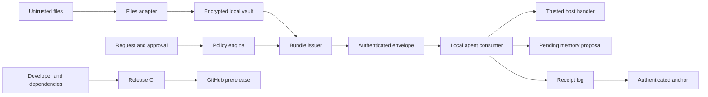

# Context Layer v0.2-draft threat model

**Status:** provisional repository-grounded review for the experimental single-user profile
**Review date:** 2026-08-21

## Executive summary

The highest-risk paths are failures that let raw vault material or excess capability cross the policy boundary, forged or stale authorization that produces an authenticated bundle, and receipt failures that hide an external side effect. The repository has meaningful controls for the tested single-user profile: exact-purpose policy, authenticated approvals, minimum-expiry HMAC envelopes, recipient and capability binding, payload-free receipts, an authenticated receipt anchor, and a root-confined files adapter. Those controls do not make this a production or hostile-administrator-resistant system. Key custody, identity assurance, remote multi-user isolation, durable revocation, and an externally rollback-resistant receipt checkpoint remain deployment responsibilities.

## Scope and assumptions

In scope:

- `packages/local-core/`: vault, policy, bundle authority, bundle issuer, files adapter, local-agent consumer, memory proposals, receipt log, and receipt anchor.
- `protocol/spec/`: v0.2 specification prose, implementation guidance, and architecture diagram.
- `protocol/reference/`, `protocol/schemas/`, and `protocol/fixtures/`: dependency-free reference runtime, strict object contracts, and synthetic examples.
- `examples/`, `test-vectors/v0.2/`, and `tests/`: synthetic proof and security regressions.
- `.github/workflows/ci.yml`, `package.json`, and `package-lock.json`: release integrity and dependency boundary.

Out of scope:

- Website application, hosting, routing, and deployment source, which are intentionally maintained outside this protocol repository.
- A production identity provider, approval service, key-management service, multi-tenant vault, or remote MCP server.
- Operating-system, hypervisor, kernel, or cryptographic primitive compromise.
- Recovery from an attacker who can replace both a receipt log and its authenticated anchor with an older valid pair.
- Real personal or regulated data; repository fixtures and demos are required to remain synthetic.

Material assumptions:

- The local core is a single-user prototype on a workstation whose administrator, kernel, and process boundary are trusted.
- Capability-handler implementations are operator-controlled, trusted in-process host code. Their source/model-derived inputs and returned values may be attacker-controlled; admitting attacker-supplied handler code is same-process compromise and outside this profile.
- Vault and HMAC keys arrive through external key providers, are not committed, and are unavailable to untrusted source content or bundle consumers.
- Requests, files, source instructions, claims, bundles, and handler output may be attacker-controlled.
- A deployment stores the receipt anchor on a boundary at least independent from accidental log damage. A same-filesystem attacker can still coordinate rollback.

These assumptions were presented during the working session and no corrections were received before this provisional report. Risk rankings are conditional on them.

Open questions that would materially change risk:

- Will the next deployment accept remote users, remote agents, or multiple tenants, and what authenticates each principal?
- Where will vault keys, bundle-authority keys, approval-verifier keys, and the receipt checkpoint be stored?
- Which real data classes and irreversible external actions will be permitted after the synthetic phase?

## System model

### Primary components

- **Local vault:** encrypts versioned payload envelopes with AES-256-GCM and an externally supplied key; see `packages/local-core/vault.mjs` (`openLocalVault`).
- **Capture adapter:** confines UTF-8 file capture to configured roots, rejects symlinks and oversized or changing files, and stores private path data inside the vault; see `packages/local-core/files-adapter.mjs` (`createUtf8FilesAdapter`).
- **Policy engine:** produces allow, allow-with-reductions, deny, or needs-approval decisions bound to request and policy digests; see `packages/local-core/policy.mjs` (`evaluatePolicy`, `validateApproval`).
- **Bundle boundary:** filters claims, applies declared transforms, derives minimum expiry, strips raw provenance, and authenticates a recipient-bound envelope; see `packages/local-core/bundle.mjs` and `packages/local-core/authority.mjs`.
- **Local-agent consumer:** verifies envelope authority, recipient, expiry, revocation, replay state, and capability before invoking trusted in-process host handler code with potentially untrusted inputs; memory writes remain proposals; see `packages/local-core/consumer.mjs` (`createLocalAgentConsumer`).
- **Receipt subsystem:** validates minimized receipts, serializes append operations across processes, hash-chains entries, and authenticates a sidecar checkpoint; see `packages/local-core/receipt-log.mjs` and `packages/local-core/receipt-anchor.mjs`.
- **Public contract:** strict JSON Schemas, synthetic fixtures, and a dependency-free reference implementation define the portable v0.2 object boundary; see `protocol/schemas/`, `protocol/fixtures/`, and `protocol/reference/`.
- **CI and release:** locked npm dependencies, Linux and Windows CI, lint, audit, hygiene, and tests gate the public snapshot; see `.github/workflows/ci.yml`.

### Data flows and trust boundaries

- **Allowed local file -> files adapter -> vault:** UTF-8 bytes and file metadata cross a filesystem boundary. Root canonicalization, symlink rejection, regular-file checks, size limits, before/after metadata checks, and strict UTF-8 decoding run before capture. Authentication of file authorship is not provided.
- **Requester and policy -> policy engine:** identities, purpose code, task, selectors, actions, retention, receipt requirement, and optional approval cross an authorization boundary through in-process objects. Strict shapes, allowlists, digests, approval verification, expiry, and receipt preflight constrain the decision; caller identity remains deployment-supplied.
- **Vault-derived claims -> bundle issuer:** selected claim values and private provenance references cross the raw-vault disclosure boundary. The issuer applies granted selectors and transforms, replaces provenance with opaque handles, rejects forbidden raw material, and signs a minimum-expiry envelope.
- **Authenticated envelope -> local-agent consumer -> trusted host handler:** scoped context and capabilities cross from the trusted issuer through the consumer into operator-controlled in-process code. Envelope content and model-derived arguments may be attacker-controlled. HMAC verification, recipient binding, expiry, revocation, single-use replay control, capability checks, and receipt preflight run before invocation; they do not sandbox the handler or constrain its ambient process authority.
- **Trusted host handler -> receipt log:** potentially attacker-influenced output digest, outcome, summary, and bounded string metadata cross from action execution into integrity-critical audit state. Raw payload inclusion is forbidden; post-action persistence failure is reported as indeterminate.
- **Consumer -> memory proposal:** derived claims cross toward durable memory only as a pending, provenance-bound proposal requiring user confirmation. No commit API exists in the local profile.
- **Developer dependency graph -> CI -> GitHub release:** source and third-party packages cross a supply-chain boundary. A lockfile, clean install, lint, dependency audit, release-hygiene scan, two-OS tests, and exact-tag procedure provide evidence; maintainer and GitHub account security are external.

#### Diagram

## Assets and security objectives

| Asset | Why it matters | Security objective (C/I/A) |
| --- | --- | --- |
| Raw source payloads and private provenance | Disclosure defeats the system's primary privacy boundary | C, I |
| Vault encryption key | Key theft exposes all locally encrypted payloads | C, I |
| Policy, request, and approval evidence | Unauthorized mutation can broaden scope or actions | I, A |
| Bundle-authority key and authenticated envelopes | Forgery can grant context or capabilities to the wrong recipient | C, I |
| Scoped context and capabilities | Even minimized context may be sensitive and action grants may be irreversible | C, I |
| Receipt log and authenticated anchor | Audit truth, replay prevention, and indeterminate outcomes depend on them | I, A |
| Pending memory proposals | Silent or forged durable memory can corrupt later decisions | I |
| Canonical schemas, code, test vectors, and release tag | Reviewers rely on a stable, reproducible proof-of-work snapshot | I, A |

## Attacker model

### Capabilities

- Supply malicious files, filenames, encodings, source instructions, context requests, claims, bundles, handler output, and protocol objects to an embedding application.
- Replay, modify, truncate, or replace unprotected local files that the embedding process permits them to reach.
- Control source/model-derived values that reach trusted orchestration or cause a trusted handler to return malformed or non-serializable values.
- Publish a malicious or vulnerable transitive dependency if upstream package or maintainer controls fail.

### Non-capabilities

- No assumed administrator, kernel, debugger, or arbitrary same-process memory access on the trusted workstation.
- No ability to replace, inject, or execute capability-handler code inside the trusted host process. If this assumption fails, the handler already has the host process's ambient authority and the consumer's capability checks are not an isolation boundary.
- No assumed access to external key providers, the bundle-authority key, an independently protected receipt checkpoint, or authenticated approval keys.
- No production multi-tenant API, remote vault interface, or real-data deployment exists in this repository.
- No claim is made that HMAC records are verifiable by independent third parties.

## Entry points and attack surfaces

| Surface | How reached | Trust boundary | Notes | Evidence (repo path / symbol) |
| --- | --- | --- | --- | --- |
| File capture | `captureFile` with a configured path | Filesystem -> adapter -> vault | Paths, links, size, encoding, and change races are security-sensitive | `packages/local-core/files-adapter.mjs:createUtf8FilesAdapter` |
| Policy request | `evaluatePolicy` | Requester -> policy engine | Identity assertions are supplied by the embedding deployment | `packages/local-core/policy.mjs:evaluatePolicy` |
| Approval object | Optional approval and verifier callback | Approval authority -> policy engine | Exact request, policy, scope, signature-verifier result, and expiry binding are required | `packages/local-core/policy.mjs:validateApproval` |
| Claim set | `issueScopedBundle` | Vault-derived records -> disclosure boundary | Claim filtering, transforms, opaque provenance, and raw-material scanning occur here | `packages/local-core/bundle.mjs:issueScopedBundle` |
| Bundle envelope | Consumer `open` | Issuer -> consumer | HMAC, recipient, expiry, revocation, replay, and size checks precede use | `packages/local-core/consumer.mjs:createLocalAgentConsumer` |
| Capability handler | Consumer `execute` | Scoped authority -> trusted host code -> external side effect | Handler code is trusted and deployment-supplied; its source/model-derived inputs and returned values may be malicious or unreliable, and no in-process sandbox is provided | `packages/local-core/consumer.mjs:execute` |
| Memory proposal | Consumer `proposeMemoryUpdate` | Model output -> durable-memory review | Only pending proposals with provenance and user confirmation requirements are emitted | `packages/local-core/consumer.mjs:validateMemoryUpdateProposal` |
| Receipt append and reopen | `openReceiptLog`, `append`, `verifyReceiptLog` | Runtime events -> audit state | Multi-process locking, chain checks, and authenticated anchor state protect integrity | `packages/local-core/receipt-log.mjs`; `receipt-anchor.mjs` |
| Public protocol objects | Validator functions or JSON Schema | External object -> reference runtime | Closed schemas reject unknown fields and forbidden secret-bearing names | `protocol/reference/context-layer-reference.mjs`; `protocol/schemas/*.schema.json` |
| Release pipeline | Push or pull request | Maintainer/dependencies -> public artifact | Locked install, audit, hygiene, lint, and tests; account controls are external | `.github/workflows/ci.yml` |

## Top abuse paths

1. **Exfiltrate raw vault content:** submit a broad or malformed request -> exploit selector, transform, provenance, or serializer drift -> receive raw payload or a resolvable private path in a bundle or receipt -> correlate or retrieve private source data.
2. **Forge authorization:** construct a decision or approval that appears valid but is not bound to the exact request, policy, scope, verifier, and expiry -> issue an authenticated envelope -> execute an otherwise unauthorized action.
3. **Expand a consumer's authority:** alter an envelope, substitute the recipient, replay a single-use bundle, or race revocation -> convince a consumer to expose context or invoke a capability after authority ended.
4. **Turn content into instructions:** place prompt-injection text in an allowed file or claim -> induce trusted orchestration to request a granted but unintended capability or unsafe destination -> exploit a host integration that derives authority-bearing arguments from source prose rather than approved policy and user intent.
5. **Erase audit evidence after a side effect:** complete an irreversible trusted-handler action -> trigger an attacker-controlled non-serializable result, force receipt persistence failure, or replace audit files -> cause downstream logic to treat the outcome as failed, absent, or replayable.
6. **Escape file roots:** use traversal, symlinks, reparse behavior, or a time-of-check/time-of-use swap -> capture a file outside an approved root -> encrypt it correctly but disclose data the user never selected.
7. **Leak a credential through metadata or errors:** place secret-shaped content in a request, handler result, summary, or metadata -> serialize it into a bundle, receipt, log, demo output, or published protocol artifact -> expose it to reviewers or consumers.
8. **Roll back local authorization history:** obtain write access to both receipt log and co-located anchor -> restore an older valid pair -> remove evidence and replay state without breaking HMAC verification.
9. **Publish the wrong contract:** compromise a dependency, maintainer account, CI configuration, or tag procedure -> ship stale schemas, malicious code, or an unreviewed build under `v0.2-draft`.

## Threat model table

| Threat ID | Threat source | Prerequisites | Threat action | Impact | Impacted assets | Existing controls (evidence) | Gaps | Recommended mitigations | Detection ideas | Likelihood | Impact severity | Priority |
| --- | --- | --- | --- | --- | --- | --- | --- | --- | --- | --- | --- | --- |
| TM-001 | Malicious requester, claim source, or serializer | Attacker controls request or candidate claims and reaches issuance | Smuggle excessive, raw, or provenance-resolvable data across the bundle boundary | Private data disclosure | Raw payloads, provenance, scoped context | Exact selectors, transforms, opaque provenance, forbidden-material scan, strict bundle validation (`bundle.mjs`); isolation tests (`tests/local-core.test.mjs`) | Content-based secret detection is necessarily incomplete; semantic over-disclosure remains possible | Add sensitivity labels and per-predicate output bounds; independently fuzz schema/runtime parity; require review for new claim types | Count reductions and rejections by predicate; alert on new bundle fields, large bundles, or raw-material failures | Medium | High | High |
| TM-002 | Forged requester or approval producer | Embedding app accepts weak identity or verifier behavior | Bind false identity, purpose, scope, or approval to a decision | Unauthorized disclosure or action | Policy, approval evidence, capabilities | Request/policy digests, exact purpose codes, four states, fail-closed approval verifier and expiry (`policy.mjs`) | Principal authentication and approval-key custody are external | Define production principal and approval credential formats; verify them before `evaluatePolicy`; separate approval and policy signing keys | Log reason codes and approval-verification states without payloads; alert on repeated binding failures | Medium | High | High |
| TM-003 | Malicious consumer or transport peer | Attacker can intercept or replay an envelope, or influence revocation provider | Tamper, retarget, replay, or use an expired/revoked bundle | Context theft or unauthorized capability use | Bundles, capabilities, recipient state | HMAC envelope, full canonical digest, recipient binding, minimum expiry, strict revocation result, durable replay receipt (`authority.mjs`, `bundle.mjs`, `consumer.mjs`) | HMAC is shared-secret and local-profile only; revocation durability is deployment-defined | Use asymmetric issuer signatures for remote consumers; publish key IDs and rotation; persist revocation on an authenticated store | Track verification failures, replay conflicts, expired use, and malformed revocation results | Medium | High | High |
| TM-004 | Malicious source content or attacker-controlled model output | Untrusted content reaches trusted orchestration that can select a granted capability or construct its arguments | Convert content into authority-bearing instructions, unsafe destinations, or an unintended use of an otherwise granted capability | External side effects or data disclosure | Capabilities, external accounts, scoped context | Capabilities are structural, not prompt-derived; consumer invocation checks the named grant and receipt contract (`consumer.mjs:execute`) | The consumer does not validate capability-specific arguments or constrain the trusted handler's ambient process authority; destination allowlists and user confirmation UX are external | Use per-capability typed arguments, destination allowlists, idempotency keys, and explicit user confirmation for irreversible actions | Receipt every attempt and denial; alert on repeated ungranted capabilities, unusual argument shapes, or destination changes | Low in the synthetic local profile; Medium if model-driven actions are enabled | High | Medium |
| TM-005 | Local storage failure, process crash, or attacker-controlled action result | Attacker can alter audit files, influence handler output, or force failure after a side effect | Truncate/rewrite receipts, race append, or hide a completed action behind a missing or non-serializable receipt result | False audit history, replay, duplicate side effects | Receipt log, anchor, replay state | Exact receipt schema, process lock, hash chain, authenticated anchor, recovery states, indeterminate outcome (`receipt-log.mjs`, `receipt-anchor.mjs`) | A co-located old log-and-anchor pair can be replayed; no external monotonic counter | Store checkpoint in OS keychain, TPM-backed monotonic service, or remote compare-and-set store; use action idempotency keys | Alert on anchor auth failures, recovery-required states, indeterminate outcomes, and stale locks | Medium | High | High |
| TM-006 | Malicious local file or filesystem actor | Attacker controls paths or can change files during capture | Escape an allowed root or swap file identity/content during read | Unauthorized local data capture | Raw files, vault | Canonical roots, component-wise symlink rejection, regular-file and size checks, before/after state, strict UTF-8 (`files-adapter.mjs`) | Platform-specific reparse points and network filesystems need deployment testing | Open by trusted directory handle where supported; document supported filesystems; keep Windows and Linux integration tests | Count path, symlink, race, size, and encoding rejections; audit configured roots | Low | High | Medium |
| TM-007 | Malicious input, attacker-controlled action output, or developer fixture | Attacker can place secret-like values in serialized fields or logs | Persist credentials or raw payload in receipts, bundles, errors, demos, or release files | Credential compromise or secondary private dataset | Keys, receipts, public artifacts | Closed schemas, forbidden field names, bounded flat receipt metadata, payload flag false, sanitized handler errors, release hygiene (`canonical.mjs`, `receipt-log.mjs`, `scripts/release-hygiene.mjs`) | Arbitrary prose can contain secrets that do not match patterns | Add deployment DLP for configured credential formats; keep summaries templated; never log raw validation objects | Scan release artifacts and structured logs; alert on secret-field rejection and unusually long summaries | Medium | High | High |
| TM-008 | Host administrator or same-process compromise | Attacker obtains process memory, key provider, or both log and anchor | Steal keys, decrypt vault, forge HMAC records, or replay old state | Total local confidentiality and integrity loss | Vault key, authority key, all local data | Keys supplied externally, copied then zeroed on close; no committed keys (`vault.mjs`, `authority.mjs`) | Hostile administrator and memory inspection are explicitly out of scope | For production, use OS keystore or hardware-backed non-exportable keys, process isolation, least privilege, and external receipt checkpoint | OS key-access audit, process integrity monitoring, rotation events, failed key IDs | Low under stated assumption | High | Medium |
| TM-009 | Compromised dependency, maintainer, or CI identity | Upstream or publishing account is compromised | Modify code, lockfile, CI, tag, or release notes | Malicious public artifact and loss of reviewer trust | Source, test and release evidence, tag, GitHub repo | Locked install, zero-high audit gate, lint, hygiene, Windows/Linux tests, exact-tag checklist (`.github/workflows/ci.yml`, `RELEASE.md`) | Branch protection, signed tags, maintainer MFA, and artifact attestations are external | Require protected main and CI, least-privilege tokens, MFA, signed tag or provenance attestation, dependency update review | GitHub audit log, dependency alerts, tag-to-commit verification, release checksum | Low to Medium | High | High |
| TM-010 | Curious or malicious requester | Attacker can make repeated semantically similar requests | Infer private attributes from allow/deny/reduction/timing responses | Privacy leakage without direct payload access | Policy state, subject privacy | Purpose binding, reasoned decisions, rate/anomaly hooks, spec guidance on uniform responses (`policy.mjs`; technical specification section 11) | Local core does not implement a semantic privacy budget or uniform response service | Add requester/subject/purpose privacy budgets, batching, response normalization, and coordinated-client detection in network profiles | Track semantically similar probes and decision distributions without raw prompts | Medium for a future network service | Medium | Medium |

## Criticality calibration

- **Critical:** remotely reachable compromise with no trusted-user action that exposes an entire real vault, forges production authorization across tenants, or executes arbitrary privileged code. Examples: unauthenticated remote raw-vault dump; remote capability execution as another tenant; release-key compromise that silently ships malicious runtime code.
- **High:** practical bypass of a core invariant with meaningful private-data or external-action impact. Examples: forged approval issues a valid bundle; recipient/replay bypass executes a granted action twice; raw source content enters a scoped bundle or receipt.
- **Medium:** targeted integrity, availability, or partial disclosure requiring local access, unusual timing, or a future network deployment. Examples: file-capture race on an unsupported filesystem; coordinated log-and-anchor rollback by a local actor; repeated policy probing that reveals a bounded private attribute.
- **Low:** noisy or easily reversible failures with no sensitive payload or authority impact. Examples: a malformed synthetic fixture causes a local test-only denial or an invalid protocol object is rejected without exposing protected state.

## Focus paths for security review

| Path | Why it matters | Related Threat IDs |
| --- | --- | --- |
| `packages/local-core/policy.mjs` | Authorization, purpose, approval, reduction, expiry, and receipt-preflight decisions converge here | TM-002, TM-010 |
| `packages/local-core/bundle.mjs` | This is the raw-vault disclosure boundary and authenticated-envelope constructor | TM-001, TM-003, TM-007 |
| `packages/local-core/authority.mjs` | HMAC key ownership, signing, verification, and zeroing protect bundle authenticity | TM-003, TM-008 |
| `packages/local-core/consumer.mjs` | Recipient, replay, revocation, capability, handler, and memory-proposal enforcement occur here | TM-003, TM-004, TM-005 |
| `packages/local-core/vault.mjs` | Encryption envelope correctness and key lifecycle protect raw local payloads | TM-001, TM-008 |
| `packages/local-core/files-adapter.mjs` | Filesystem canonicalization and race resistance gate what enters the vault | TM-006 |
| `packages/local-core/receipt-log.mjs` | Audit validation, append serialization, replay state, and crash recovery are integrity-critical | TM-005, TM-007 |
| `packages/local-core/receipt-anchor.mjs` | Anchor authentication is the only local evidence against log-only rollback and rewrite | TM-005, TM-008 |
| `packages/local-core/canonical.mjs` | Canonical serialization, record identity, and forbidden-material detection affect every signed object | TM-001, TM-003, TM-007 |
| `protocol/reference/context-layer-reference.mjs` | Portable runtime/schema parity prevents downstream fail-open behavior | TM-001, TM-002, TM-007 |
| `protocol/schemas/*.schema.json` | Closed object contracts bound extension, transform, receipt, and authority surfaces | TM-001, TM-002, TM-003 |
| `protocol/fixtures/*.json` | Valid and invalid synthetic examples expose contract drift without real user data | TM-001, TM-002, TM-007 |
| `.github/workflows/ci.yml` | The public proof-of-work claim depends on reproducible, cross-platform, audited release checks | TM-009 |

## Quality check

- [x] Covered every discovered runtime and contract entry point: file capture, request, approval, claims, envelope, handler, memory proposal, receipt state, schemas, reference runtime, and release pipeline.
- [x] Represented each trust boundary in at least one abuse path and threat.
- [x] Separated local runtime, portable protocol artifacts, CI/release, and tests/examples; website and deployment source are outside this repository's scope.
- [x] Recorded that the assumption-validation questions received no correction before this provisional report.
- [x] Kept production identity, key custody, remote multi-tenancy, hostile administrator, and real-data use as explicit open questions rather than implied controls.
